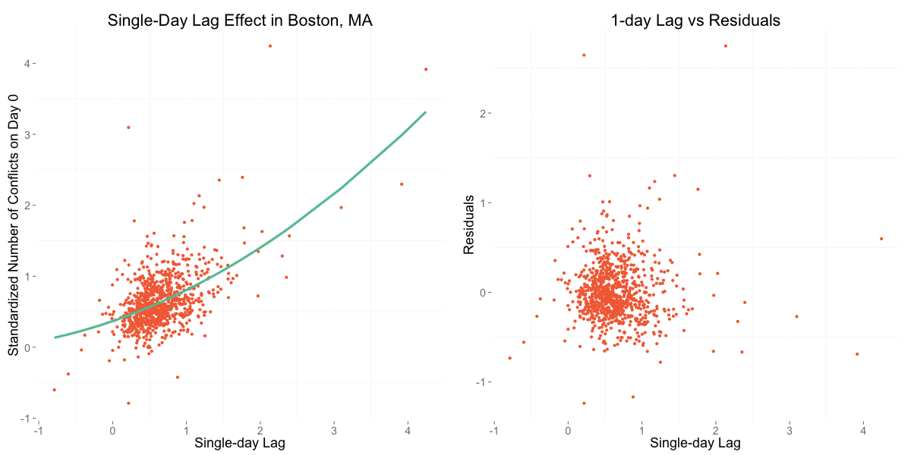
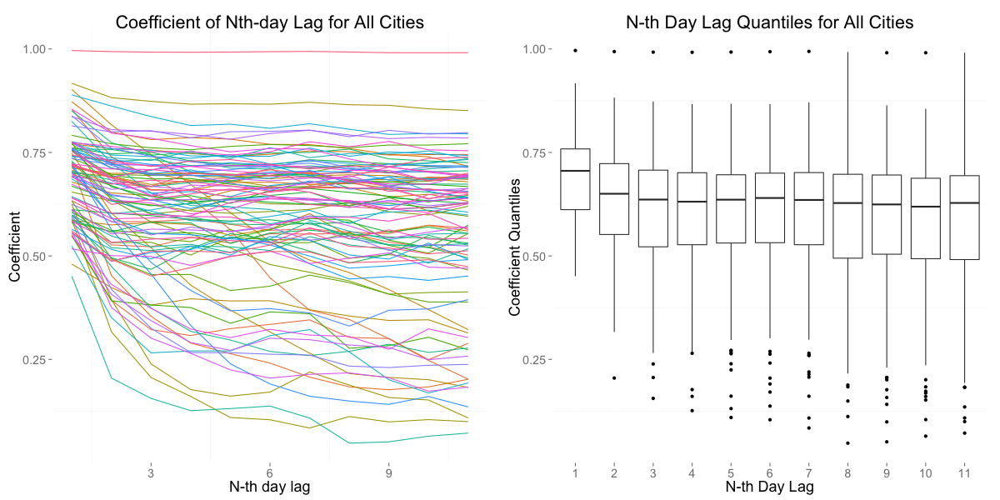
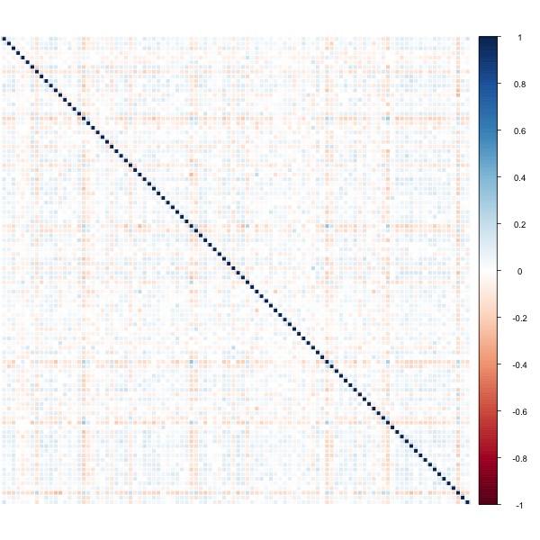
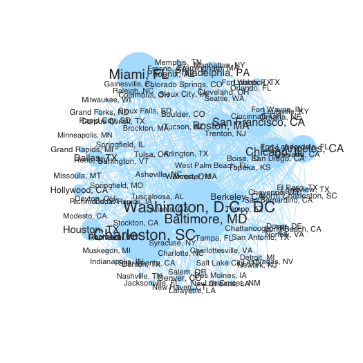
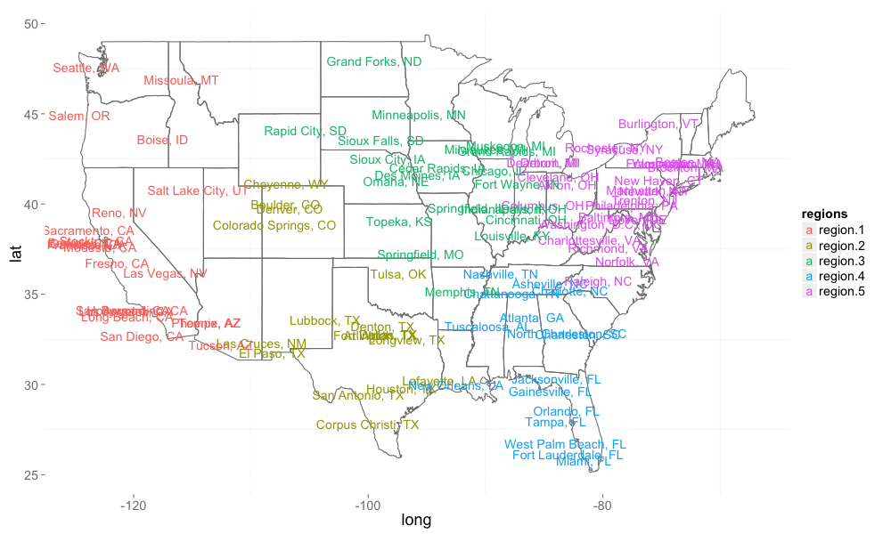

# Group 8 Analytics Milestone

The analysis in the app is structured as follows:

1. Data Summary
2. Analysis
3. Results and Cross-Validation
4. Conclusions

## 1. Data Summary

In the data summary, the subselection of data is detailed and graphs demonstrate the endogenous characterstics of the data. We found that:

* The data is stationary over the period of interest, so it does not need to be standardized over time. We use the log of the number of conflicts as our dependent variable.
* Washington D.C. has a much higher mean than the rest of the data.
* Weekends have a lower mean than weekdays.
* Population has a positive and non-linear relationship with number of conflicts.

## 2. Analysis

To study the question `How does conflict spread?`, the analysis includes a study of both time and space.

#### Auto-Regression

A vector auto-regressive matrix was used to regress 1 to n-days worth of lags. These tests were all found to be highly significant, with the first day's lag having the highest impact. This effect is repeated for every 7 day window that strengthens our belief that time does have a reliable effect.

[TODO] Some cities' number of conflicts were found to be non-stationary during this analysis. An auto-regressive regression on the differences will be used to address this non-stationarity.

#### Networks

Basic Lasso and the SPACE algorithm were used to explore the partial correlation across cities. Both algorithms exposed cities with a greater number of correlations across the set, and these 'high-influence' cities were often represented in the results of both algorithms. However, SPACE resulted in a power law distribution of the degree of edges and basic lasso did not. There is a natural expectation of a "hub" phenomena in partial correlation analysis that suggests the result of the SPACE algorithm is more realistic.

[TODO] With the resulting sparse matrix, each city's individual network will be estimated for goodness-of-fit to understand how well the city's network explains its level of conflict.

Using a k-means algorithm, the data was clustered into regions. This clustering method was used as a proxy to study the effect of distance between cities. That is, cities which are in the same region as city x are closer to city x and thus we might expect a higher correlation with what happens in the same region than in other regions.

Using these regions, the number of conflicts was regressed on the average value for all cities in the same region as well as the average value for each other region. This yielded inconsistent results but the quantiles of coefficients suggested there may be a greater "same region" effect than the effect of any other region.

## 3. Results and Cross-Validation

Using the terms from the auto-regression and network analyses, the first aggregated model fit was:

```r
log_num_conflicts ~ 0 + (lag.log_num_conflicts + same_region + 
    region.1 + region.2 + region.3 + region.4 + region.5 + log_population + 
    log_population_sq + isWashingtonDC + weekend)
```

This model had a high level of significance and a high R-squared (see table below). However the region effects were small and did not reflect previous estimations. So a second model was fit without the regions.

```{r}
log_num_conflicts ~ 0 + (lag.log_num_conflicts + log_population + 
    log_population_sq + isWashingtonDC + weekend)
```

Both models exhibited an R-squared of 0.821.


| Dependent variable: |  log num conflicts ||
| --------------- | -- | ------ |
|| (1) | (2) |
| lag.log num conflicts | 0.594\*** | 0.597\*** |
|| (0.003) | (0.003) |
| same region | -0.056\*** ||
|| (0.007) ||
| region.1 | -0.041\*** ||
|| (0.004) ||
| region.2 | 0.005 ||
|| (0.006) ||
| region.3 | 0.018\*** ||
|| (0.006) ||
| region.4 | 0.025\*** ||
|| (0.005) ||
| region.5 | 0.047\*** ||
|| (0.008) ||
| log population | -0.166\*** | -0.176\*** |
|| (0.004) | (0.003) |
| log population sq | 0.018\*** | 0.018\*** |
|| (0.0003) | (0.0003) |
| isWashingtonDC | 1.681\*** | 1.678\*** |
|| (0.030) | (0.030) |
| weekend | -0.407\*** | -0.410\*** |
|| (0.006) | (0.006) |
| Observations | 85,800 | 85,800 |
| R^2 | 0.821 | 0.821 |
| Adjusted R^2 | 0.821 | 0.821 |
| Residual Std. Error | 0.818 (df = 85789) | 0.818 (df = 85795) |


The condition of the design matrix however was very high. Cross-validation of the design matrix exposed the instability in the fit of the model:

|           | Test 1 | Test 2 | Test 3 | Test 4 | Test 5 |
| --------- | ------ | ------ | ------ | ------ | ------ |
| R-squared | 0.62 | 0.51 | 0.62 | 0.53 | 0.57 |
| Adjusted R-Squared | 0.71 | 0.66 | 0.71 | 0.67 | 0.69 |
| Mean Squared Error | 0.62 | 0.51 | 0.62 | 0.53 | 0.57 |

[TODO] City-level auto- and network-regression results will be available through an interactive interface. The user may select a city and see the numerical and graphical representation of the regression coefficients and the corresponding R-squareds.

## 4. Conclusions

* Time matters but we have found no evidence to support that space matters.
* A model capturing the effects of a single-day lag, population, and whether the date is on a weekend fits the data well but was not as robust in predicting out of sample sets tested during cross-validation.
* There is some evidence to suggest that big cities matter.












