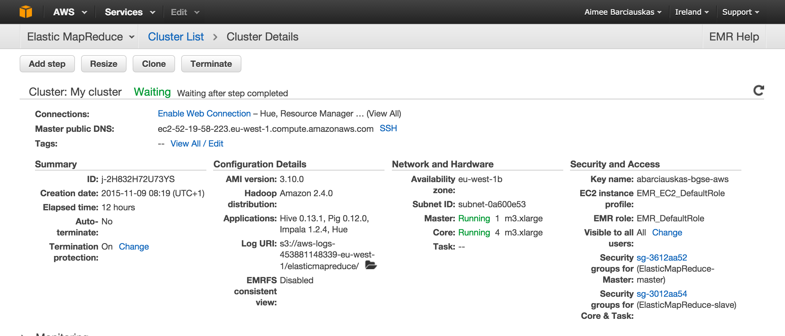

# Notes from Exploration

## Importing data

Script use for data import into RDS: [importGdeltData.R](../scripts/importGdeltData.R)

* `time`: Importing data into RDS took about 180 minutes for 1 year (15 minutes per month, using an m4.xlarge)
* `size`: Each month of data takes ~3GB of storage space

**Update 08 Nov 2015** Imported all data since April 2013.

### Process for importing data

1. imported data since April 2013 using `scripts/importGdeltData.R`
2. started emr cluster with 4 data nodes 
3. sqooped data into hdfs `scripts/sqoop-import.sh`
4. built events table using impalal `scripts/impala-queries.sql`

## Data Fields / Data Decisions

**FeatureID** Used to determine city of event. This is advised by GDELT's Data Format Codebook

> To find all events located in or relating to a specific city or geographic landmark, the Geo_FeatureID column should be used, rather than the Geo_Fullname column. This is because the Geo_Fullname column captures the name of the location as expressed in the text and thus reflects differences in transliteration, alternative spellings, and alternative names for the same location. (page 5)

